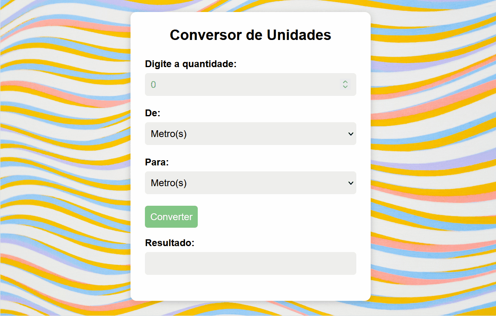

#  Unit Converter 🔂

This project is a simple unit converter web application that allows users to convert measurements between different units, including meters, kilometers, centimeters, and millimeters.

## Functionalities

 Enter a value,choose the input and output units, and the application will provide the converted result.

## Overview

